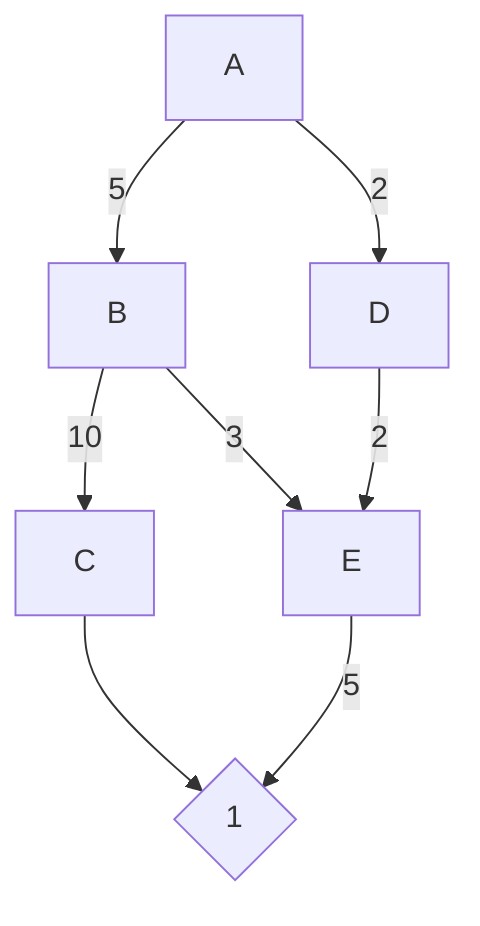

# Dijkstra
## 26 de Abril

El algoritmo de Dijkstra es un algoritmo de búsqueda de caminos en grafos que encuentra el camino más corto desde un nodo de origen a todos los demás nodos en un grafo ponderado y dirigido, siempre que los pesos de las aristas sean no negativos. Fue propuesto por el científico de la computación holandés Edsger Dijkstra en 1956.

El algoritmo de Dijkstra funciona de manera iterativa y utiliza una cola de prioridad para seleccionar el nodo con la distancia mínima conocida desde el nodo de origen en cada iteración. A continuación, se describen los pasos del algoritmo de Dijkstra:

1. Inicializar distancias y visitados: Se crea un arreglo `distancias` para almacenar la distancia más corta desde el nodo de origen hasta cada nodo. Inicialmente, se establece la distancia del nodo de origen en 0 y las distancias de todos los demás nodos en infinito. Además, se crea un arreglo `visitados` para llevar un registro de los nodos visitados.

2. Crear una cola de prioridad: Se crea una cola de prioridad (usualmente un min-heap) que almacenará los nodos y sus distancias desde el nodo de origen.

3. Agregar el nodo de origen a la cola de prioridad: Se agrega el nodo de origen a la cola de prioridad con una distancia de 0.

4. Procesar los nodos en la cola de prioridad: Mientras la cola de prioridad no esté vacía, se realiza lo siguiente:
   a. Extraer el nodo con la menor distancia conocida desde el nodo de origen (denotado como `nodoActual`).
   b. Marcar `nodoActual` como visitado.
   c. Para cada vecino de `nodoActual`, calcular la distancia desde el nodo de origen a través de `nodoActual`. Si esta distancia es menor que la distancia conocida previamente, actualizar la distancia en el arreglo `distancias` y agregar el vecino a la cola de prioridad con la nueva distancia.

5. Resultado: Una vez que se ha procesado toda la cola de prioridad, el arreglo `distancias` contendrá la distancia más corta desde el nodo de origen hasta todos los demás nodos del grafo. Si se desea reconstruir el camino más corto, se puede utilizar un arreglo adicional para almacenar el nodo previo en el camino más corto durante la actualización de las distancias.

Es importante destacar que el algoritmo de Dijkstra no funciona correctamente si hay pesos negativos en las aristas, ya que asume que las distancias nunca disminuyen al visitar un nodo. En tales casos, se puede utilizar el algoritmo de Bellman-Ford en su lugar.

## Caso practico 

**Enunciado práctico:** Supongamos que eres el desarrollador principal de una aplicación de navegación GPS para una empresa de logística. La aplicación debe proporcionar a los conductores la ruta más rápida entre dos puntos en una red de carreteras, teniendo en cuenta el tiempo estimado de conducción en cada tramo.

**Escenario hipotético:** La red de carreteras se puede modelar como un grafo dirigido y ponderado, en el que los nodos representan las intersecciones y las aristas representan los tramos de carretera entre intersecciones. Los pesos de las aristas corresponden al tiempo estimado de conducción entre las intersecciones, que puede variar debido a factores como la velocidad límite, el tráfico y las condiciones de la carretera.

Tu tarea es desarrollar un algoritmo que, dado un nodo de origen y un nodo de destino en la red de carreteras, determine la ruta más rápida para llegar al destino. En este caso, el algoritmo de Dijkstra puede utilizarse para calcular el camino más corto en términos de tiempo de conducción entre los dos puntos.

Deberás implementar el algoritmo de Dijkstra y adaptarlo a este escenario, considerando las particularidades de la red de carreteras y las condiciones de tráfico. La solución debe ser lo suficientemente eficiente para manejar una gran cantidad de nodos y aristas en la red de carreteras, proporcionando resultados en tiempo real a los conductores que utilizan la aplicación de navegación GPS.

### Ejemplo:

El grafo representa la red de carreteras con las intersecciones (nodos) y los tiempos de conducción (aristas). El algoritmo de Dijkstra se procesa en los siguientes pasos:

1. Comenzamos en el nodo A (distancia 0).
2. Exploramos los vecinos de A: nodo B (distancia 5) y nodo D (distancia 2).
3. Elegimos el nodo D (distancia más corta conocida) y exploramos sus vecinos: nodo E (distancia total 4).
4. Elegimos el nodo E (distancia más corta conocida) y exploramos sus vecinos: nodo B (no actualizamos la distancia) y nodo F (distancia total 9).
5. Elegimos el nodo B (distancia más corta conocida) y exploramos sus vecinos: nodo C (distancia total 15).
6. Finalmente, el algoritmo nos muestra que la ruta más rápida desde A hasta C es A -> B -> C, con una distancia total de 15 minutos.

El diagrama  ayuda a visualizar la red de carreteras y comprender cómo el algoritmo de Dijkstra explora los nodos y actualiza las distancias para encontrar el camino más corto.
